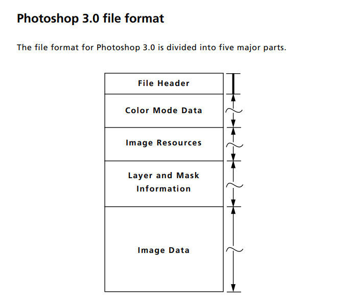
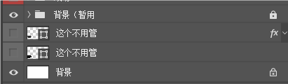
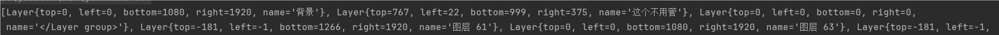

## 概述
在和朋友一起做游戏的时候发现，朋友给的psd文件，图层导出成png图片之后，放入unity中还需要自己再设置每一个图层的位置，十分麻烦。基于偷懒想法，准备自己解析psd文件，获取图层信息。

[pad文档](https://www.moon-soft.com/program/FORMAT/graphics/PSD.pdf)

[参考blog](https://my.oschina.net/u/185335?tab=newest&catalogId=3507302)



我们需要的信息就在 Layer and mask information 中
### java实现

```java
public static Map<String, Layer> getLayer(String path) throws IOException {
        File file = new File(path);
        Map<String, Layer> layers = new HashMap<>();

        try (FileInputStream fileInputStream = new FileInputStream(file)) {
            // 2-7 File header
            fileInputStream.skip(26);
            // 2–8: Color mode data
            skip(readInteger(fileInputStream), fileInputStream);
            // 2–9: Image resources
            skip(readInteger(fileInputStream), fileInputStream);
            // 2–10: Layer and mask information

            // Length
            readInteger(fileInputStream);

            // 2-12 Layers
            // Length
            readInteger(fileInputStream);

            // 2-13 Layers structure

            // Count
            int size = readShort(fileInputStream);

            for (int i = 0; i < size; i++) {
                Layer layer = new Layer();
                // 图层坐标
                layer.top = readInteger(fileInputStream);
                layer.left = readInteger(fileInputStream);
                layer.bottom = readInteger(fileInputStream);
                layer.right = readInteger(fileInputStream);

                // Number channels
                int channelCount = readShort(fileInputStream);
                // 2-15 Channel length info
                skip(channelCount * 6, fileInputStream);
                // Blend mode signature
                // Blend mode key
                // Opacity
                // Clipping
                // Flags
                // (filler)
                // 一起跳过
                skip(12, fileInputStream);

                // Extra data size
                // Length of the extra data field. This is the total length of the next five fields.
                // 后续扩展数据的总长度，计算偏移量到下一个图层
                int extraDateLength = readInteger(fileInputStream);

                // 2-16 Layer mask data
                // Size of the data. This will be either 0x14, or zero (in which case the following fields are not present).
                int layerMaskSize = readInteger(fileInputStream);
                extraDateLength -= 4;

                if (layerMaskSize != 0) {
                    skip(layerMaskSize - 4, fileInputStream);
                    extraDateLength -= (layerMaskSize - 4);
                }

                // 2-17 Layer blending ranges
                int layerBlendingRangesLength = readInteger(fileInputStream);
                extraDateLength -= 4;
                skip(layerBlendingRangesLength, fileInputStream);
                extraDateLength -= (layerBlendingRangesLength);

                // Layer name
                // Pascal string, padded to a multiple of 4 bytes.
                // 图层名字，使用Pascal string保存，即1 byte保存长度，后续保存字符串，对齐4 byte，psd编码格式为gbk？
                int stringSize = readByte(fileInputStream);
                extraDateLength -= 1;
                byte[] stringBytes = new byte[stringSize];
                fileInputStream.read(stringBytes);
                extraDateLength -= stringSize;
                layer.name = new String(stringBytes, Charset.forName("gbk"));

                // 跳过剩余部分到下一图层
                skip(extraDateLength, fileInputStream);
                layers.put(layer.name, layer);
            }

        }catch (IOException e) {
            throw new RuntimeException(e);
        }

        // 处理成配置文件
        return layers;
    }

    private static void skip(int length, FileInputStream fileInputStream) throws IOException {
        fileInputStream.skip(length);
    }

    private static int toInt(byte[] bytes) {
        return (bytes[0] & 0xFF) << 24 | (bytes[1] & 0xFF) << 16 | (bytes[2] & 0xFF) << 8 | (bytes[3] & 0xFF);
    }

    private static int toShort(byte[] bytes) {
        return (bytes[0] & 0xFF) << 8 | (bytes[1] & 0xFF);
    }

    private static int readByte(FileInputStream fileInputStream) throws IOException {
        byte[] bytes = new byte[1];
        fileInputStream.read(bytes);
        return bytes[0];
    }

    private static int readShort(FileInputStream fileInputStream) throws IOException {
        byte[] bytes = new byte[2];
        fileInputStream.read(bytes);
        return toShort(bytes);
    }

    private static int readInteger(FileInputStream fileInputStream) throws IOException {
        byte[] bytes = new byte[4];
        fileInputStream.read(bytes);
        return toInt(bytes);
    }

    public static class Layer {
        int top;
        int left;
        int bottom;
        int right;
        String name;

        @Override
        public String toString() {
            return "Layer{" +
                    "top=" + top +
                    ", left=" + left +
                    ", bottom=" + bottom +
                    ", right=" + right +
                    ", name='" + name + '\'' +
                    '}';
        }
    }
```

### 解析结果



