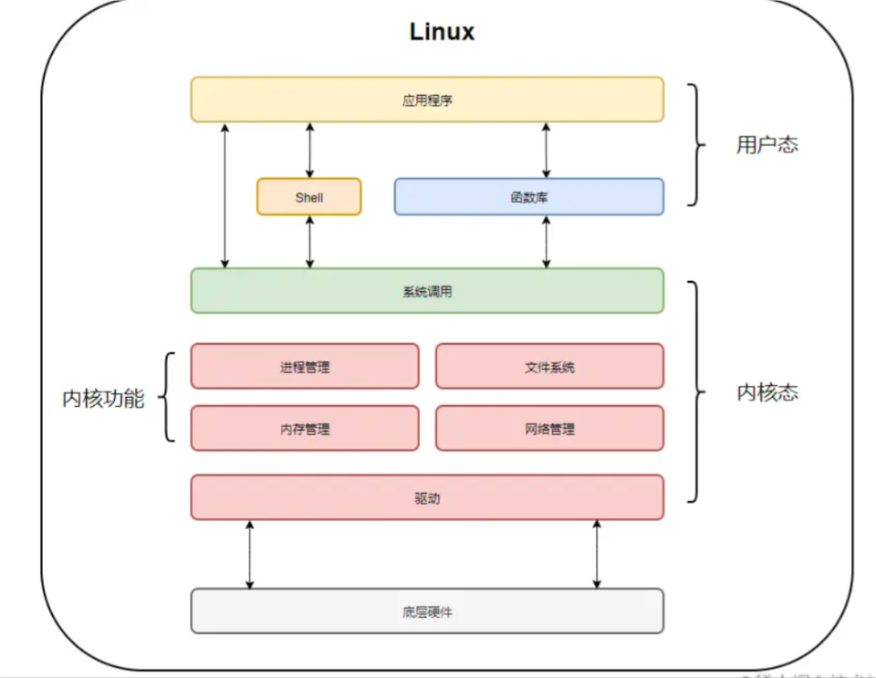
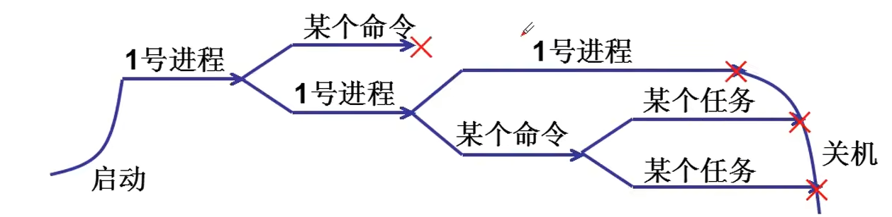

# 概述

本篇主要讲述自己学习观看操作系统视频后的一些思考后的总结。

## 学习资料链接
[【【哈工大】操作系统 李治军（全32讲）](https://www.bilibili.com/video/BV19r4y1b7Aw/?share_source=copy_web&vd_source=6ac655718838a59f1a953a645d8f1fd4)

## 综述

### 什么是操作系统

计算机（computer）俗称电脑，是现代一种用于高速计算的电子计算机器，可以进行数值计算，又可以进行逻辑计算，还具有存储记忆功能。是能够按照程序运行，自动、高速处理海量数据的现代化智能电子设备。

### 操作系统

这里并不会详细操作系统，具体有兴趣可以去仔细查看视频链接学习，老师讲的十分细致。我只想大致记录，学习之后想通的一些关键细节。

#### 操作系统启动
当按下开机键后，硬件上电自检完成后，自动加载磁盘上数据到内存中，这部分加载的数据就是操作系统程序，加载过程由硬件控制。一般来说，对于现代电脑，这个部分都是主板来进行控制，上电自检硬件，然后通过主板BIOS选择系统盘所在磁盘，启动后加载操作系统到内存中，程序计数器指向操作系统第一行程序，然后开始顺序执行程序，也就是将控制权交给操作系统，操作系统开始接管电脑。

后续就是软件层面对于硬件管理初始化，比如内存分页。

最后系统启动完成，监听用户输入。

#### 内核态和用户态

* 在CPU的所有指令中，有一些指令是非常危险的，如果错用，将导致整个系统崩溃。比如：清内存、设置时钟等。如果所有的程序都能使用这些指令，那么你的系统一天死机N回就不足为奇了。
* 所以，CPU将指令分为特权指令和非特权指令，对于那些危险的指令，只允许操作系统及其相关模块使用，普通的应用程序只能使用那些不会造成灾难的指令。
* 如此设计的本质意义是进行权限保护。 限定用户的程序不能乱搞操作系统，如果人人都可以任意读写任意地址空间软件管理便会乱套。

#### 系统调用

一个系统接口(规范)，内核之外的用户进程需要操作硬件时使用。

#### 多进程图像

进程必须是运行的程序。当内存中的一百行指令按照顺序，取指执行，取指执行下去，这个才算是运行了一段程序，而这个取指执行的过程就是进程。现在计算机需要运行qq程序，那么就创建qq进程。需要运行一个游戏程序，就创建一个游戏进程。同时需要听歌，就创建一个音乐进程。

CPU会在成功执行一个指令后，通过系统调度，选择一个进程执行，并将正在执行的进程现场保存到pcb(记录进程状态的数据结构)中，比如qq程序执行到70行，那么就保存在内存中，下次继续执行qq进程时，从70行程序开始执行。由于多个进程都是同时推进，并且切换速度很快，人无法识别，所以我们看来就是，我后台挂着qq，放着歌，打游戏。

操作系统成功启动后通过创建一个shell进程(windows是一个桌面进程)交给用户使用。
然后用户通过这个进程创建其他进程。

#### 用户级线程

#### 内核栈和用户栈

内核在创建进程的时候，在创建task_struct的同时，会为进程创建相应的堆栈。每个进程会有两个栈，一个用户栈，存在于用户空间，一个内核栈，存在于内核空间。当进程在用户空间运行时，cpu堆栈指针寄存器里面的内容是用户堆栈地址，使用用户栈；当进程在内核空间时，cpu堆栈指针寄存器里面的内容是内核栈空间地址，使用内核栈。

QA：那么为什么不直接用一个栈，何必浪费那么多的空间呢？

1. 如果只用系统栈。系统栈一般大小有限，如果中断有16个优先级，那么系统栈一般大小为15（只需保存15个低优先级的中断，另一个高优先级中断处理程序处于运行）。但用户程序子程序调用次数可能很多，那样15次子程序调用以后的子程序调用的参数、返回值、返回点以及子程序(函数)的局部变量就不能被保存，用户程序也就无法正常运行了。

2. 如果只用用户栈。我们知道系统程序需要在某种保护下运行，而用户栈在用户空间（即cpu处于用户态，而cpu处于内核态时是受保护的），不能提供相应的保护措施（或相当困难）。

#### 内存管理

#### 为什么要段页结合
