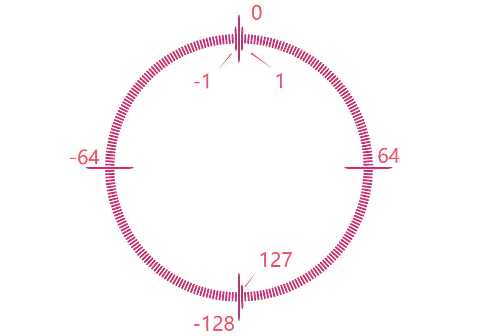
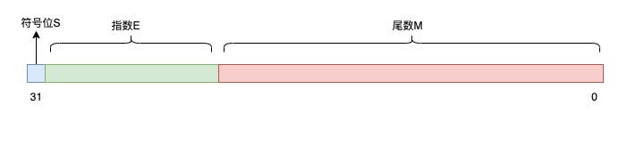

# 概述

本篇主要讲述自己学习观看计算机组成视频后的一些思考后的总结。

## 学习资料链接
[计算机组成原理（哈工大刘宏伟）135讲（全）高清](https://www.bilibili.com/video/BV1t4411e7LH/?share_source=copy_web&vd_source=6ac655718838a59f1a953a645d8f1fd4)

## 综述

### 什么是计算机

计算机（computer）俗称电脑，是现代一种用于高速计算的电子计算机器，可以进行数值计算，又可以进行逻辑计算，还具有存储记忆功能。是能够按照程序运行，自动、高速处理海量数据的现代化智能电子设备。

### 计算机基本组成

这里并不会详细讲解计算机是怎么组成的，具体有兴趣可以去仔细查看视频链接学习，老师讲的十分细致。我只想大致记录，学习之后想通的一些关键细节。

#### 冯诺依曼机

现代计算机大多数都是冯诺依曼结构即：

1. 计算机由运算器、控制器、存储器、输入设备、输出设备构成。
2. 数据和程序都是存放在统一存储器中，不加以区别。
3. 指令和数据均以二进制编码表示。
4. 指令由操作码和地址码组成。
5. 指令在存储器中按其顺序存放，由指令计数器(又称程序计数器)指明要执行的指令所在的存储单元的地址。

#### 总线

冯诺依曼架构下的计算机可以由大量的io设备，不可能每个设备都通过固定接口进行连接，那样线路过于复杂且不具扩展性，所以需要通过公共的线路进行连接，所有设备都连接到这个线路上，通过不同的协议进行设备区分(可以类比计算机网络ip定位来理解，实际上并没有到网络那么复杂)。不同类型设备连接不同的总线，常见总线有三种：地址总线，控制总线，数据总线。比如一个内存，它有地址和数据的需求，就连接地址总线和数据总线，CPU还要控制是读还是写，所以还要连接控制总线。

#### 二进制加减实现(原码，反码，补码)

首先明确一个观点，为什么要有原码反码补码的设定，本质上是为了解决负数在计算机中的表示形式，使得所有的加减法都可以写成1 + (-3) + (5) + (-7)这种纯加法的形式，硬件只处理加法，就能够得到正确的结果。

那怎么表示负数表示来解决这个问题呢？
即定义负数的二进制为还差多少越界即可，比如-1，就是顺时钟走了255格，还差一格越界为0。

那么对于64 + (-1) 来说，就是顺指针走255格，相当于逆时针走一格，也就是63了。

接下来就是通过定义求出指定为位置的二进制值，这个值就是补码。

1. 机器数：一个数在计算机中的二进制表示形式，最高位为符号位。-3就是10000011(八位字长);
2. 真值：就是这个数的十进制表示形式，10000011就是-3;
3. 原码：机器数。
4. 反码：正数的反码是其本身，负数的反码是在其原码的基础上, 符号位不变
5. 补码：正数的补码就是其本身，负数的补码是在其原码的基础上, 符号位不变, 其余各位取反, 最后+1. (即在反码的基础上+1)

从定义也可以看出，所有条件都是在特殊处理负数。-3的反码为11111100，3的原码为00000011, 这两个二进制相加就是11111111，再加一就越界为0了，所以-3的反码还差3 + 1越界，对于任意一个负数，它的反码加上它的绝对值的都为0xFF，再加一都会越界。所以这个结论推广到所有负数，负数的补码是在其原码的基础上, 符号位不变, 其余各位取反, 最后+1. (即在反码的基础上+1)。

乘法除法，不展开说。本质就是小学数学列竖式计算。

#### 浮点数

二进制的科学计数法表示：

$$S*M*2^E$$
值得一提的是，同样是64为长整数和64为浮点数，浮点数的表示范围会远远大于长整数，但是由于尾数部分只有52位，当同样表示大于52的整数时，浮点数会由于尾数存不下这么大数导致丢失精度。

#### 锁存器存储

使用锁存器保存电信号，实现内存保存电信号功能

#### io设备

#### 中断

#### 指令集

#### 指令流水